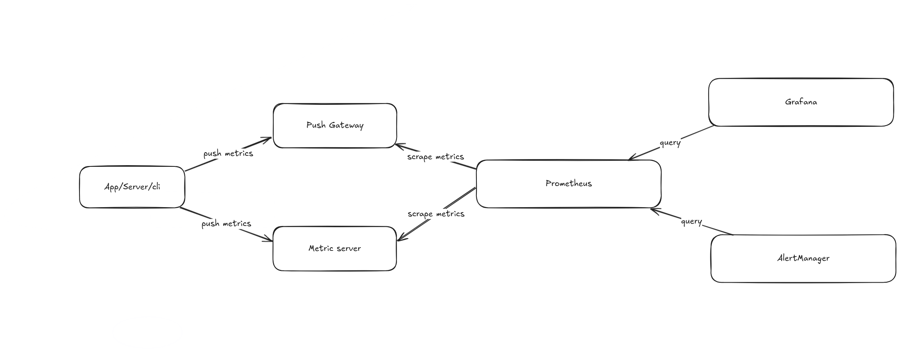

# Observability playground

My objective with this repository is to play around with metrics and
observability tools, and to learn how to use them effectively. Observability
includes several pieces, from metrics, to alert system and visualization.

For metrics, the tool selected for this playground is
[Prometheus](https://prometheus.io/). It is a system frequently used in many
projects, which supports distributed installations (native, docker, kubernetes).

Prometheus offers an alerting system, which is
[Alertmanager](https://prometheus.io/docs/alerting/latest/alertmanager/).

For visualization, I have selected [Grafana](https://grafana.com/), which is a
popular tool for creating dashboards and visualizing metrics from various data
sources, including Prometheus.

In the following diagram, you can see the components of this playground and how they
interact with each other:



## Getting started

A docker compose file is provided to run all the components together. To start
services, run:

```bash
task build
```

To stop and remove the services, run:

```bash
task clean
```

You have a health check for the services, which can be run with:

```bash
task health
```

## Accessing the services

- Prometheus: [http://localhost:9090](http://localhost:9090)
- Push gateway: [http://localhost:9091](http://localhost:9091)
- Alertmanager: [http://localhost:9093](http://localhost:9093)
- Grafana: [http://localhost:3000](http://localhost:3000)

## Concepts

Let's review some of the concepts used in this playground:

- [metric](./docs/metrics.md): a numerical value that represents a measurement
  of a system or application. Metrics can include labels (key-value pair) that
  provides additional context. Labels can be used to filter and group metrics.
- [alert](./docs/alerts.md): a condition that is triggered when a metric meets a
  certain threshold or condition. Alerts can be used to notify users or trigger
  actions when a system or application is not behaving as expected.
- [query](./docs/quering.md): a request to retrieve data from Prometheus.
  Queries can be used to filter, group, and aggregate metrics.
- [data visualization](./docs/visualization.md): the process of creating visual
  representations of data to help understand and analyze it.
